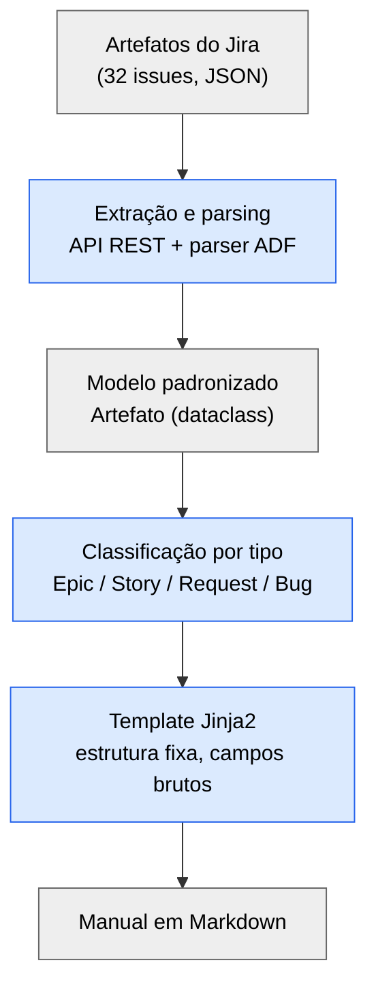
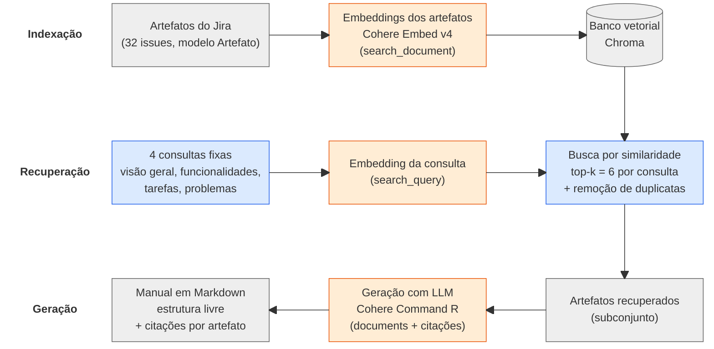
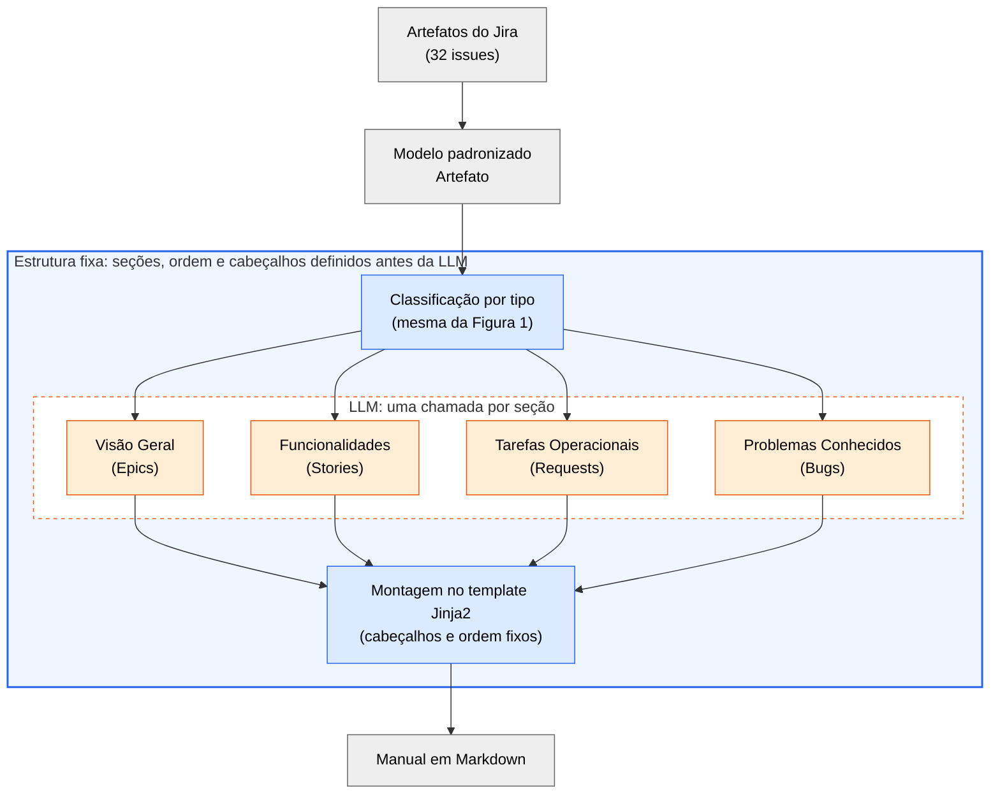
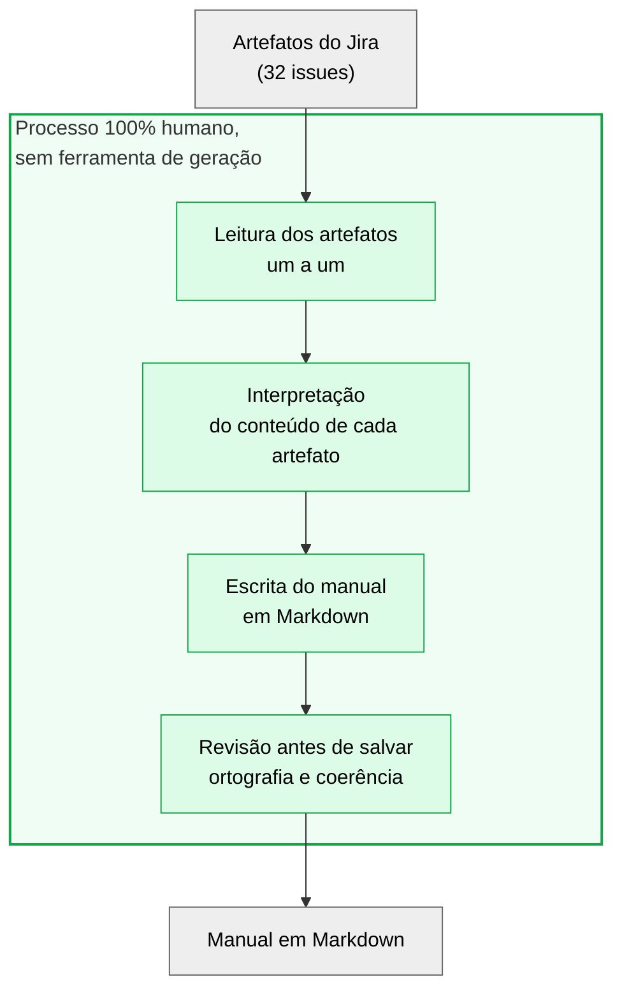
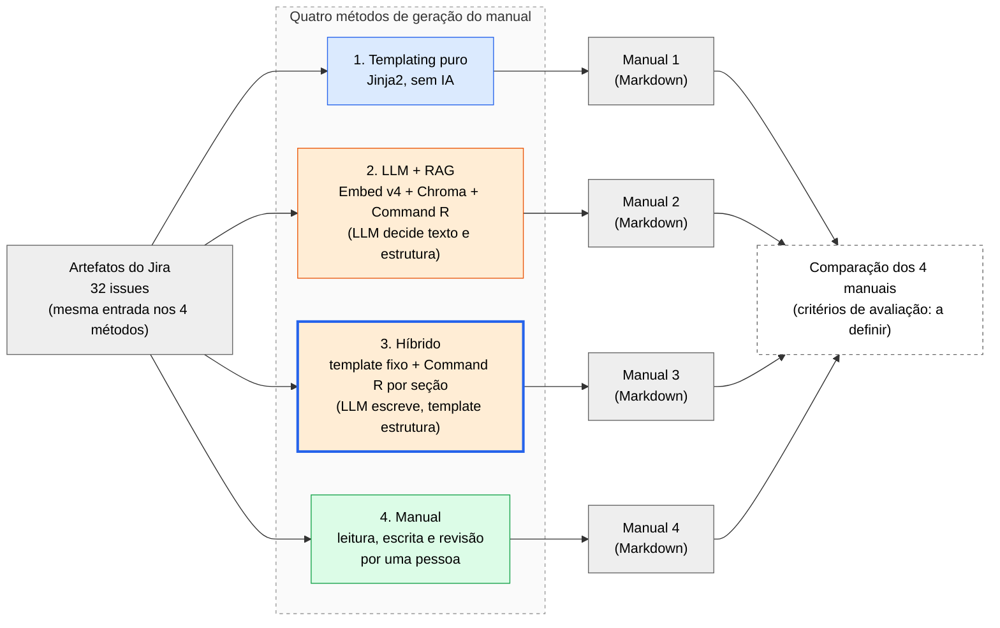
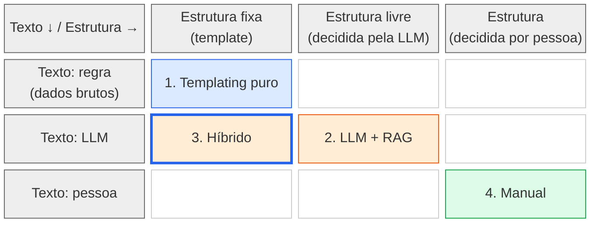
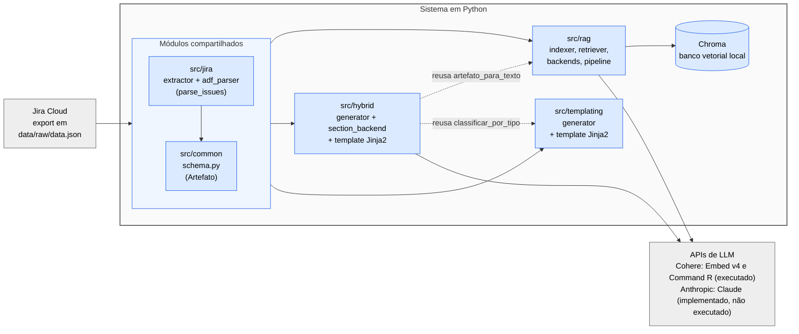
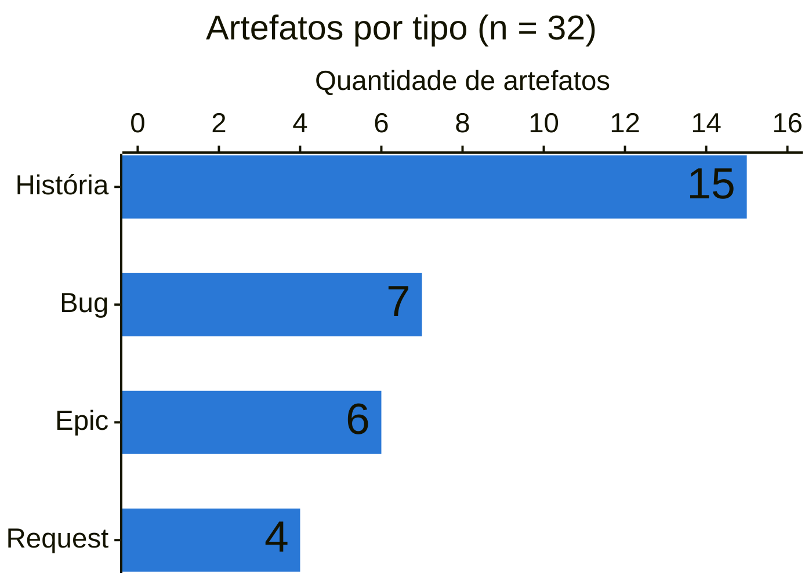

# Diagramas dos 4 métodos (para uso no TCC)

> Como usar: copie o bloco ```mermaid de cada diagrama em https://mermaid.live,
> ajuste se quiser e exporte como PNG/SVG. Todos seguem a mesma convenção
> visual, para o leitor comparar os métodos lado a lado:
>
> - **Cinza** = dado (entrada/saída)
> - **Azul** = etapa determinística (código/regra, sem IA)
> - **Laranja** = etapa com LLM
> - **Verde** = etapa humana
>
> Entrada e saída são idênticas nos 4 métodos (mesmos 32 artefatos do Jira
> → um manual em Markdown). O que muda é o que fica no meio.

## Convenção de estilos (colar no fim de cada diagrama)

```
classDef dado fill:#eeeeee,stroke:#666,color:#000;
classDef regra fill:#dbeafe,stroke:#2563eb,color:#000;
classDef llm fill:#ffedd5,stroke:#ea580c,color:#000;
classDef humano fill:#dcfce7,stroke:#16a34a,color:#000;
```

---

## Figura 1 — Templating puro (Jinja2)

O que mostrar: pipeline 100% determinístico. Legenda sugerida: "Nenhuma
etapa usa IA; mesma entrada gera sempre a mesma saída."



Quem decide o texto: ninguém (dados formatados). Estrutura: fixa (template).

---

## Figura 2 — LLM + RAG

O que mostrar: duas fases (indexação e recuperação) e depois a geração livre.
Legenda sugerida: "A LLM decide texto e estrutura; a recuperação só
seleciona quais artefatos entram no contexto."



Quem decide o texto: a LLM. Estrutura: a LLM.

> Decisão sua: o código também tem a variante Claude (Messages API) no lugar
> do Command R, mas ela **não foi executada**. Se for mostrar, desenhe como
> caixa tracejada ("H2 — Claude, implementado, não executado") ou deixe só
> na descrição da figura.

---

## Figura 3 — Híbrido (template + LLM por seção)

O que mostrar: a estrutura vem do template, a LLM só escreve o corpo de cada
seção. Legenda sugerida: "Document planning fixo (moldura azul); microplanning e
realization delegados à LLM (caixas laranja), uma chamada por seção."



Quem decide o texto: a LLM. Estrutura: fixa (template). Sem embeddings nem
recuperação. A LLM escreve só o corpo de cada seção (o prompt proíbe criar
cabeçalhos). Cada chamada recebe só os artefatos da sua categoria, não o
corpus inteiro (dizer isso na legenda da figura).

---

## Figura 4 — Manual (humana)

O que mostrar: mesmo insumo, processo inteiramente humano, sem nenhuma etapa
automatizada. Legenda sugerida: "Leitura, interpretação, escrita e revisão
feitas manualmente, como no fluxo clássico de um QA manual."



Quem decide o texto: a pessoa. Estrutura: a pessoa.

---

## Figuras adicionais para Materiais e Métodos

Ordem sugerida no texto: A (desenho do estudo) → B (matriz) → D (dados) →
Figuras 1 a 4 (um método por figura) → C (módulos). Detalhes em
`docs/diagramas/README.md`. Arquivos em
`docs/diagramas/`.

### Figura A — Desenho do estudo (`estudo_desenho.png`)

Mostra que os 4 métodos partem da mesma entrada e chegam a 4 manuais que serão
comparados. **A caixa "Comparação" está tracejada de propósito**: os critérios de
avaliação ainda não estão definidos no projeto — substitua pelo que você usar.
Legenda sugerida: "Desenho do estudo: os mesmos 32 artefatos do Jira alimentam
quatro métodos de geração de manual."

Notas para a legenda: nos métodos 2 e 3 só a variante Cohere (Command R,
temperatura 0,3) foi executada; a variante Claude está implementada, mas não
foi executada.



### Figura B — Matriz de posicionamento dos métodos (`estudo_matriz.png`)

Posiciona cada método por quem escreve o texto (linhas) e quem decide a
estrutura (colunas). As células vazias são combinações que o estudo não cobre.
O híbrido tem borda azul grossa (estrutura do template) com preenchimento
laranja (texto da LLM), para ficar visível que ele mistura os dois.
Referência para a legenda: Reiter & Dale (2000), estágios de NLG.



### Figura C — Módulos do sistema (`arquitetura_modulos.png`)

Diagrama de módulos/componentes **inspirado no C4** (não é um diagrama C4
estrito: os módulos são pacotes Python de uma só aplicação, não contêineres
implantáveis). Dependências extraídas dos `import` reais em `src/`. As setas
tracejadas mostram reaproveitamento de código entre etapas
(`classificar_por_tipo` e `artefato_para_texto`). Chroma é local, em
`.chroma/rag`.



### Figura D — Composição do conjunto de dados (`dados_composicao.png`)

Contagem por tipo conferida direto em `data/raw/data.json`: 15 História, 7 Bug,
6 Epic e 4 Request (total 32). Para a legenda: os dados são fictícios; no
método de templating, História vira "Funcionalidades", Request vira "Tarefas
Operacionais", Epic vira "Visão Geral" e Bug vira "Problemas Conhecidos".
Uma série só, por isso sem legenda de cores; os valores estão rotulados nas
barras.



### Referências sugeridas para as legendas das figuras adicionais

Estas referências vêm de memória e **precisam ser conferidas nas fontes originais antes
de entrar no TCC**.

| Figura | Referência |
|---|---|
| A, B | Reiter & Dale (2000); Gatt & Krahmer (2018), já nos docs de cada etapa |
| C | Modelo C4 (S. Brown, c4model.com); ISO/IEC/IEEE 42010 (descrição de arquitetura) |
| D | Sem referência de método; cite a origem dos dados (`data/raw/data.json`) |

### Como regenerar os PNGs (gratuito, local)

```
npx @mermaid-js/mermaid-cli -i figura.mmd -o figura.png -b white -s 3
```

Troque `.png` por `.svg` para vetorial. O bloco mermaid de cada figura vai num
arquivo `.mmd` (só o conteúdo, sem as cercas de código).

---

## Sugestão de legendas com fonte (o TCC exige referência para cada método)

Todas já constam nos documentos de cada etapa:

| Figura | Referência para citar na legenda |
|---|---|
| 1 | Reiter & Dale (2000); Gatt & Krahmer (2018) — abordagem *template-based* de NLG |
| 2 | Lewis et al. (2020) — RAG; Cohere (Embeddings e RAG, docs oficiais) |
| 3 | Reiter & Dale (2000) — estágios de NLG; Gatt & Krahmer (2018) — arquiteturas híbridas |
| 4 | Sem referência de código; se quiser embasar a estrutura do manual: ISO/IEC/IEEE 26514:2008 |

## Extra opcional: quadro-resumo (pode virar uma Figura 5 ou tabela)

| Método | Texto | Estrutura | Usa LLM | Usa recuperação |
|---|---|---|---|---|
| Templating | dados brutos | fixa | não | não |
| LLM + RAG | LLM | LLM | sim | sim |
| Híbrido | LLM | fixa | sim | não |
| Manual | humana | humana | não | não |
